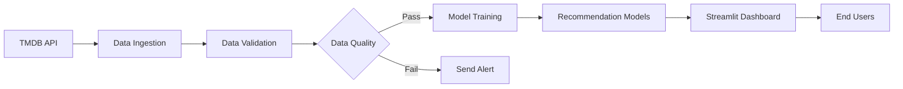

# TMDB Movie Recommender 

[](#)
[](#)
[](#)
[](#)
[](#)
[&labelColor=FFFFFF&color=rgb(77%2C%20171%2C%20207))](#)
[](#)
[](#)
[](LICENSE)

A robust movie recommendation system powered by TMDB data with automated data pipelines, content-based filtering, and an interactive dashboard. This project demonstrates a complete machine learning workflow from data ingestion to model deployment.

## 🚀 Quick Start

### Option 1: Docker (Recommended)
```bash
# Clone repository
git clone https://github.com/your-username/tmdb-movie-recommender.git
cd tmdb-movie-recommender

# Configure environment
cp .env.sample .env
nano .env  # Add your TMDB API key

# Build and run container
docker build -t movie-recommender .
docker run -d \
  -p 8501:8501 \
  -v ./data:/app/data \
  -v ./models:/app/models \
  --env-file .env \
  --name movie-rec \
  movie-recommender

Access dashboard at: http://localhost:8501

### Option 2: Manual Execution
```
# Fork and clone repository
git clone https://github.com/YOUR-USERNAME/tmdb-movie-recommender.git
cd tmdb-movie-recommender

# Set up environment
python -m venv venv
source venv/bin/activate  # Linux/MacOS
venv\Scripts\activate    # Windows
pip install -r requirements.txt

# Configure API key
cp .env.sample .env
nano .env  # Add your TMDB API key

# Run pipeline and launch dashboard
python pipelines/movie_pipeline.py
streamlit run dashboard/app.py
```

Access dashboard at: http://localhost:8501

## Key Features
- **Automated Data Pipeline** - Scheduled daily updates from TMDB API
- **Content-Based Recommendations** - TF-IDF vectorization for accurate suggestions
- **Self-Healing Architecture** - Automatic fallback to sample data during API failures
- **Data Quality Monitoring** - Validation checks with email alert system
- **Lightning Fast Storage** - DuckDB database for efficient query performance
- **Interactive Dashboard** - Streamlit interface with movie posters
- **Containerized Deployment** - Docker support for seamless deployment
- **Workflow Orchestration** - Prefect pipeline for end-to-end automation

## System Architecture


## First Run Process
- Initial setup (20-40 minutes):
   - Fetches 5000+ movies from TMDB API
   - Performs data quality checks
   - Trains recommendation models
   - Builds local database

- Subsequent runs:
   - Uses cached data/models
   - Dashboard starts in seconds
   - Scheduled daily updates

## Data Management

### Persistent Storage Locations

| Location   | Docker Mount              | Description                 |
|------------|---------------------------|-----------------------------|
| `./data`   | `-v ./data:/app/data`     | DuckDB database files       |
| `./models` | `-v ./models:/app/models` | Trained models and metadata |

### Manual Data Refresh
```
# Docker
docker exec movie-rec python scripts/data_ingestion.py

# Manual
python scripts/data_ingestion.py
```

## Dashboard Features

Accessible at http://localhost:8501:

- **Personalized Recommendations** - Get suggestions based on content similarity
- **Dynamic Filters** - Filter by release year (1970-2025) and rating (0-10)
- **Top Rated Films** - Discover highest rated movies with visual ratings
- **Database Explorer** - Browse all movies in sortable table
- **System Monitoring** - View dataset stats and model version
- **Movie Details** - See posters, ratings, and descriptions

https://via.placeholder.com/800x400.png?text=Movie+Recommender+Interface
*Interactive dashboard showing recommendations and filters*

## Configuration Options
Edit `.env` file for these settings:
```
# Required
TMDB_API_KEY="your_tmdb_api_key"

# Optional
HTTP_PROXY="http://proxy:port" 
HTTPS_PROXY="https://proxy:port"
ALERT_EMAIL_USER="your@email.com"  # For data alerts
ALERT_EMAIL_PASS="app_password"    # Email app password
```

## Hardware Requiremnets
| Compnent | Minimum  | Recommended |
|----------|----------|-------------|
| RAM      | 8GB      | 16GB+       |
| Storage  | 2GB free | 5GB+ free   |
| CPU      | 4 cores  | 8 cores     |

## Troubleshooting Guide

| Issue                    | Solution                                    |
|--------------------------|---------------------------------------------|
| API requests failing     | Verify TMDB_API_KEY in `.env`               |
| Memory errors (Docker)   | Increase Docker RAM to 8GB+                 |
| Dataset not updating     | Run `data_ingestion.py` manually            |
| Training failures        | Check `models/training.log`                 |
| Port conflict            | Change port in Docker/Streamlit command     |
| Slow performance         | Reduce pages in `fetch_tmdb_data(pages=20)` |

## Maintenance Commands
```
# Stop Docker container
docker stop movie-rec

# Remove Docker container
docker rm movie-rec

# View Docker logs
docker logs movie-rec

# Clear Streamlit cache
streamlit cache clear

# Force full pipeline re-run
rm -rf data/* models/*
python pipelines/movie_pipeline.py
```

## Contribution Guidelines
- Fork repository
- Create feature branch (git checkout -b feature/improvement)
- Commit changes (git commit -am 'Add new feature')
- Push to branch (git push origin feature/improvement)
- Create pull request

## License
This project is licensed under the MIT License - see the [LICENSE](LICENSE) file for details.

## Acknowledgments
- Movie data provided by [The Movie Database](https://www.themoviedb.org/)
- Powered by [Streamlit](https://streamlit.io), [Prefect](https://prefect.io), and [DuckDB](https://duckdb.org)
- Inspired by similar recommender systems from Netflix and Hulu
